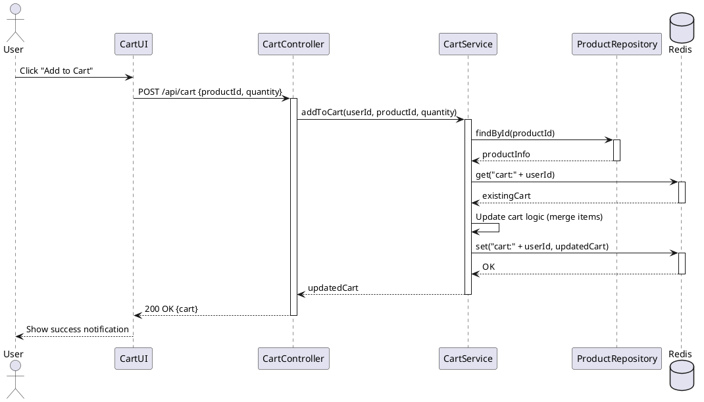

# Cart Module Design

## Overview
Xây dựng chức năng Giỏ hàng sử dụng Redis để lưu trữ tạm thời, đảm bảo tốc độ truy xuất cao và tuân thủ nguyên tắc SOLID.

## Sequence Diagram: Add to Cart



## API Specification

| Method | Endpoint | Description |
|--------|----------|-------------|
| GET | /api/cart | Lấy toàn bộ sản phẩm trong giỏ hàng |
| POST | /api/cart | Thêm sản phẩm vào giỏ hàng |
| PUT | /api/cart/:productId | Cập nhật số lượng của một sản phẩm |
| DELETE | /api/cart/:productId | Xóa một sản phẩm khỏi giỏ hàng |
| DELETE | /api/cart | Làm trống giỏ hàng |

## Data Structure in Redis
Key: `cart:{userId}`
Value: JSON String
```json
{
  "items": [
    {
      "productId": "...",
      "name": "...",
      "price": 1000,
      "quantity": 2,
      "imageUrl": "..."
    }
  ],
  "totalAmount": 2000
}
```
