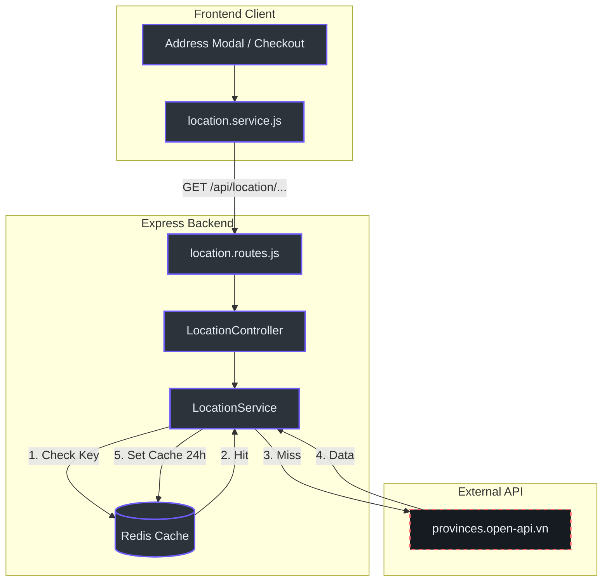

# Kiến trúc Location Proxy & Caching

Hệ thống Location Proxy được xây dựng nhằm giải quyết bài toán phụ thuộc vào dữ liệu hành chính từ bên thứ ba, đảm bảo tính ổn định và tốc độ phản hồi cực nhanh cho các tính năng liên quan đến địa chỉ (Profile, Checkout).

## 1. Overview (Tại sao?)

Hệ thống PubliCast yêu cầu dữ liệu chính xác về Tỉnh/Thành và Phường/Xã để phục vụ giao hàng. Việc gọi trực tiếp API bên ngoài từ trình duyệt gặp các vấn đề:
- **Độ trễ cao**: Phụ thuộc vào tốc độ mạng và server của `provinces.open-api.vn`.
- **Rủi ro CORS/422**: API v2 có các ràng buộc nghiêm ngặt về tham số, dễ gây lỗi nếu gọi sai định dạng từ Frontend.
- **Tính sẵn sàng**: Nếu server bên thứ ba bảo trì, khách hàng không thể thanh toán.

**Giải pháp**: Chuyển logic gọi API xuống Backend, thực hiện Proxy qua server nội bộ và lưu kết quả vào **Redis** với thời gian sống (TTL) 24 giờ.

---

## 2. Architecture (Kiến trúc)

Hệ thống được thiết kế theo mô hình **Cache-Aside Pattern**:



---

## 3. Data Flow (Luồng dữ liệu)

Luồng lấy danh sách Phường/Xã phẳng (Flat list) để tối ưu hóa việc tìm kiếm tự động từ bản đồ:

```mermaid
sequenceDiagram
    autonumber
    skinparam backgroundColor #161b22
    skinparam sequenceMessageAlign center
    
    participant FE as Frontend Service
    participant BE as LocationController
    participant SVC as LocationService
    participant Redis as Redis
    participant EXT as OpenAPI v2

    FE->>BE: GET /api/location/provinces/01/wards
    activate BE
    
    BE->>SVC: getWards("01")
    activate SVC
    
    SVC->>Redis: get("location:wards:01")
    activate Redis
    
    alt Cache Hit
        Redis-->>SVC: JSON String
        SVC-->>BE: Object Array
    else Cache Miss
        Redis-->>SVC: null
        deactivate Redis
        
        SVC->>EXT: GET /api/v2/p/01?depth=2
        activate EXT
        EXT-->>SVC: { wards: [...] }
        deactivate EXT
        
        SVC->>Redis: set("location:wards:01", data, EX: 86400)
        activate Redis
        Redis-->>SVC: OK
        deactivate Redis
        
        SVC-->>BE: Object Array
    end
    
    deactivate SVC
    BE-->>FE: HTTP 200 OK
    deactivate BE
```

---

## 4. Implementation Details (Chi tiết triển khai)

### A. Backend Service (`backend/src/services/location.service.js`)
Service sử dụng `axios` để thực hiện request và `redisClient` để quản lý bộ nhớ đệm. 
- **Cấu hình TTL**: `24 * 60 * 60` (86,400 giây) `(backend/src/services/location.service.js:8)`.
- **Hàm `getWards`**: Sử dụng tham số `depth=2` của API v2 để lấy danh sách phường xã trực tiếp từ tỉnh thành `(backend/src/services/location.service.js:38)`.

### B. Backend Controller (`backend/src/controllers/location.controller.js`)
Đóng vai trò điều phối, nhận `provinceCode` từ `req.params` và trả về JSON hoặc lỗi 500 kèm thông báo tiếng Việt thân thiện `(backend/src/controllers/location.controller.js:15-22)`.

### C. Frontend Service (`frontend/src/services/location.service.js`)
Sử dụng `apiClient` đã cấu hình sẵn (có gắn token và base URL) để gọi về backend nội bộ thay vì gọi URL tuyệt đối ra ngoài `(frontend/src/services/location.service.js:3-11)`.

### D. Tích hợp UI
- **AddressModal**: Cập nhật `useEffect` để fetch dữ liệu qua service mới `(frontend/src/pages/Profile/components/AddressModal.jsx:87)`.
- **Checkout**: Thay thế toàn bộ logic `axios.get` cũ bằng `locationService.getProvinces()` và `getWards()` `(frontend/src/pages/Checkout.jsx:136)`.

---

## 5. Danh sách API Reference

| Endpoint | Method | Chức năng | Nguồn gốc |
| :--- | :---: | :--- | :--- |
| `/api/location/provinces` | `GET` | Lấy danh sách Tỉnh/Thành | Proxy nội bộ + Cache |
| `/api/location/provinces/:code/wards` | `GET` | Lấy danh sách Phường/Xã (phẳng) | Proxy nội bộ + Cache |

---

## 6. References
- **Service Backend**: `backend/src/services/location.service.js`
- **Controller Backend**: `backend/src/controllers/location.controller.js`
- **Route Backend**: `backend/src/routes/location.routes.js`
- **App Entry**: `backend/src/app.js` (line 33)
- **Service Frontend**: `frontend/src/services/location.service.js`
- **UI Address**: `frontend/src/pages/Profile/components/AddressModal.jsx`
- **UI Checkout**: `frontend/src/pages/Checkout.jsx`
