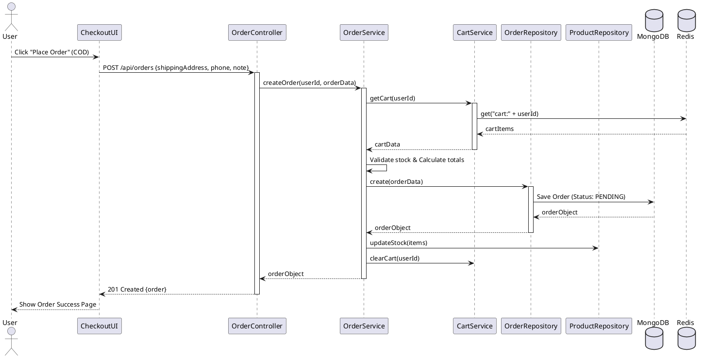

# Order & Checkout Module Design

## Overview
Xây dựng chức năng Thanh toán và Đơn hàng. Phương thức mặc định là COD (Cash on Delivery). Kiến trúc được thiết kế theo Strategy Pattern để dễ dàng tích hợp các ví điện tử (MoMo, ZaloPay, VNPay) trong tương lai.

## Sequence Diagram: Checkout (COD)



## Data Models

### Order Schema
- `userId`: ObjectId (Ref: User)
- `items`: Array
    - `productId`, `name`, `price`, `quantity`, `imageUrl`
- `totalAmount`: Number
- `shippingAddress`: String
- `phone`: String
- `status`: Enum ['PENDING', 'CONFIRMED', 'SHIPPING', 'DELIVERED', 'CANCELLED']
- `paymentMethod`: Enum ['COD', 'MOMO', 'VNPAY']
- `paymentStatus`: Enum ['PENDING', 'PAID', 'FAILED']
- `note`: String

## Strategy Pattern for Payment (Future-proof)
```javascript
interface PaymentStrategy {
  processPayment(amount, orderId): Promise<Result>;
}

class CODPayment implements PaymentStrategy { ... }
class MoMoPayment implements PaymentStrategy { ... }
```
