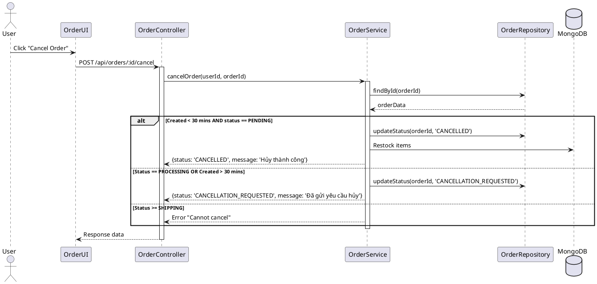

# Order Tracking & Management Design

## Overview
Cung cấp khả năng theo dõi trạng thái đơn hàng thời gian thực và quản lý quy trình hủy đơn chặt chẽ.

## Order Status Flow
1. **PENDING** (Đơn hàng mới)
2. **CONFIRMED** (Đã xác nhận - Tự động sau 30 phút hoặc thủ công)
3. **PROCESSING** (Shop đang chuẩn bị hàng)
4. **SHIPPING** (Đang giao hàng)
5. **DELIVERED** (Đã giao thành công)
6. **CANCELLED** (Đã hủy)
7. **CANCELLATION_REQUESTED** (Yêu cầu hủy đơn - Khi đã quá 30 phút hoặc đang chuẩn bị hàng)

## Cancellation Rules
- **Dưới 30 phút kể từ khi đặt:** Cho phép hủy trực tiếp (Status -> CANCELLED).
- **Trên 30 phút HOẶC Trạng thái >= PROCESSING:** Gửi yêu cầu hủy (Status -> CANCELLATION_REQUESTED). Shop sẽ duyệt thủ công.

## Sequence Diagram: Cancellation Logic

## Automatic Confirmation Logic
Sử dụng một background job hoặc đơn giản là kiểm tra thời gian khi truy xuất đơn hàng:
- Nếu `status == PENDING` và `now - createdAt > 30 mins` -> Tự động coi như `CONFIRMED`.
