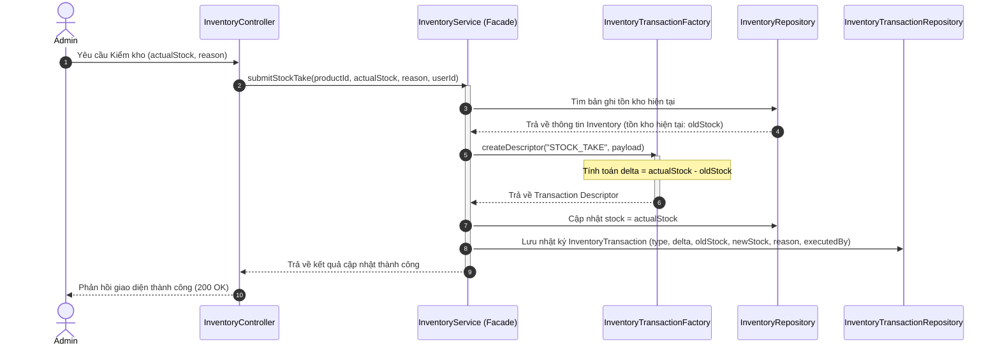

# Kiến trúc hệ thống Quản lý tồn kho & Nhật ký biến động (Inventory & Audit Logs)

Hệ thống quản lý kho hàng và ghi nhận lịch sử biến động (Audit Log) của PubliCast được thiết kế để đảm bảo tính chính xác, minh bạch và khả năng truy vết nguồn gốc (Traceability) đối với mọi hoạt động xuất-nhập tồn kho. Hệ thống tuân thủ chặt chẽ các nguyên lý SOLID và áp dụng các mẫu thiết kế (Design Patterns) tiêu chuẩn để tách biệt trách nhiệm xử lý nghiệp vụ.

---

## 1. Sơ đồ kiến trúc & Mẫu thiết kế (Architecture & Design Patterns)

Để tránh việc sửa đổi dữ liệu kho hàng trực tiếp từ nhiều nơi (gây mất mát dữ liệu hoặc thiếu sót lịch sử), hệ thống áp dụng hai mẫu thiết kế cốt lõi:

*   **Facade Pattern (`InventoryService`)**: Cung cấp một giao diện đơn giản và duy nhất cho toàn bộ các thành phần khác (Controllers, Order Handlers) tương tác với dữ liệu kho. Mọi yêu cầu tăng/giảm tồn kho bắt buộc phải đi qua Facade này để đảm bảo tự động ghi log giao dịch đồng bộ.
*   **Factory Pattern (`InventoryTransactionFactory`)**: Đóng gói logic tạo payload transaction log tùy thuộc vào loại biến động kho (`STOCK_TAKE`, `SALE`, `RESTOCK`, `RETURN`, `SYSTEM_UPDATE`). Đảm bảo logic tính toán lượng chênh lệch (Delta) được xử lý tập trung và dễ dàng mở rộng khi có loại biến động mới (OCP).

### Sơ đồ luồng hoạt động (Sequence Diagram)

Dưới đây là sơ đồ phối hợp giữa các thành phần khi thực hiện điều chỉnh tồn kho (ví dụ: Kiểm kho):

---

## 2. Mô hình Dữ liệu (Data Models)

### A. Thực thể Inventory (`Inventory.js`)
Lưu giữ trạng thái tồn kho hiện tại của từng sản phẩm liên kết với thông tin vị trí kho vật lý và ngưỡng cảnh báo:
*   `productId`: Liên kết 1-1 với collection Product.
*   `stock`: Số lượng tồn hiện tại.
*   `lowStockThreshold`: Ngưỡng cảnh báo tồn kho thấp (mặc định: `10`).
*   `warehouseLocation`: Vị trí kệ/khu chứa hàng (Ví dụ: `"Khu A-04"`).

### B. Thực thể InventoryTransaction (`InventoryTransaction.js`)
Là nhật ký ghi lại trạng thái thay đổi tồn kho. Đây là collection **chỉ-ghi (Append-Only)**, không bao giờ được phép chỉnh sửa hoặc xóa để phục vụ mục đích kiểm toán (Audit):
*   `productId`: Sản phẩm chịu biến động.
*   `type`: Loại biến động (`STOCK_TAKE` | `SALE` | `RESTOCK` | `RETURN` | `SYSTEM_UPDATE`).
*   `quantityChanged`: Số lượng thay đổi (Delta). Nhận giá trị dương (`+`) khi nhập kho, giá trị âm (`-`) khi xuất kho/bán hàng.
*   `oldStock` & `newStock`: Trạng thái tồn kho trước và sau khi biến động.
*   `reason`: Lý do chi tiết của biến động.
*   `executedBy`: Tài khoản User thực hiện hành động này.

> [!IMPORTANT]
> **Tối ưu hóa Truy vấn (Indexing):**
> Để đảm bảo hiệu năng khi danh sách log lên đến hàng triệu bản ghi, hệ thống đã thiết lập chỉ mục kép (Compound Index) phục vụ bộ lọc tìm kiếm và phân trang:
> *   `productId: 1`
> *   `type: 1`
> *   `executedBy: 1`
> *   `createdAt: -1` (Sắp xếp thời gian mới nhất lên trước)

---

## 3. Hoạt động chi tiết của các Quy trình Nghiệp vụ

### A. Luồng Đặt hàng & Bán lẻ (`SALE`)
Khi khách hàng hoàn tất thanh toán đơn hàng:
1.  `OrderSaveHandler` (trong chuỗi CoR đơn hàng) sẽ gọi Facade `InventoryService.decrementStockSafely(productId, quantity, { orderId, userId })`.
2.  Facade kiểm tra lượng tồn kho khả dụng. Nếu đủ hàng, thực hiện trừ kho.
3.  Gọi `InventoryTransactionFactory` tạo log biến động loại `SALE`, tự động gán `reason` chứa thông tin mã đơn hàng (`Order ID`).

### B. Luồng Kiểm kê định kỳ (`STOCK_TAKE`)
Khi quản trị viên thực hiện kiểm kho vật lý thực tế:
1.  Admin nhập số lượng thực tế đếm được tại kệ hàng và chọn lý do (ví dụ: *Thất thoát*, *Kiểm kho định kỳ*).
2.  Hệ thống tính toán lượng chênh lệch:
    $$\Delta = \text{Số lượng thực tế} - \text{Số lượng trên hệ thống}$$
3.  Cập nhật tồn kho trên hệ thống khớp với thực tế và ghi lại nhật ký biến động tương ứng với độ chênh lệch $\Delta$.

---

## 4. Tích hợp Giao diện & Trải nghiệm Người dùng (Frontend UX)

Giao diện quản lý tồn kho tại `/admin/inventory` được chia thành hai tab chuyên biệt:

### A. Tab "Kho hàng hiện tại" (Current Inventory)
*   Hiển thị danh sách sản phẩm, vị trí kho và số lượng tồn hiện có.
*   Hiển thị nhãn cảnh báo đỏ đối với các sản phẩm có số lượng tồn kho chạm hoặc dưới ngưỡng `lowStockThreshold`.
*   Tích hợp ô tìm kiếm và lọc nhanh sản phẩm sắp hết hàng.

### B. Tab "Lịch sử biến động kho" (Stock Movement History)
*   Bảng nhật ký hiển thị thời gian, thông tin sản phẩm, loại giao dịch (với màu sắc badge tương ứng), lượng thay đổi số lượng (`+` xanh lá khi tăng, `-` đỏ khi giảm), tồn cũ ➔ mới, người thực hiện và lý do đi kèm.
*   Hỗ trợ lọc giao dịch theo Loại biến động kho và Tìm kiếm theo tên sản phẩm.

### C. Cơ chế tự động gợi ý Vị trí kho (Hybrid Auto-Suggest)
Để giải quyết bài toán nhập tay vị trí kho dễ bị sai lệch định dạng:
*   Frontend tự động quét và thu thập danh sách tất cả các vị trí kho độc bản (unique) đang có trong database.
*   Khi Admin nhấn chỉnh sửa thông tin kho, ô nhập vị trí kho sẽ hiển thị một danh sách dropdown gợi ý dựa trên danh sách vị trí đang có qua thẻ `<datalist>`.
*   Admin vừa có thể bấm chọn nhanh các vị trí hiện có (đảm bảo tính đồng nhất), vừa có thể gõ nhập vị trí hoàn toàn mới nếu phát sinh khu lưu trữ mới.

---

## 5. Kịch bản Kiểm thử tự động (Automated Validation)

Tất cả các tình huống nghiệp vụ đã được kiểm thử tích hợp (Integration Test) tự động tại file `backend/src/tests/inventory.audit.test.js`:
*   **STOCK_TAKE Test:** Đảm bảo khi số lượng thực tế tăng/giảm so với hệ thống thì tồn kho cập nhật chính xác và ghi lại log kiểm kho có chênh lệch tương ứng.
*   **SALE Test:** Đảm bảo khi bán hàng, số lượng tồn kho giảm đúng bằng số lượng mua, ghi log loại `SALE` và liên kết với Order ID.
*   **Lỗi Vượt định mức:** Đảm bảo hệ thống ném ra lỗi không cho phép trừ kho quá lượng hàng hiện có, đồng thời không ghi bất kỳ log rác nào vào Database.
*   **RETURN Test:** Đảm bảo khi khách trả hàng/hoàn hàng, tồn kho được cộng lại đầy đủ và ghi nhận log loại `RETURN`.
