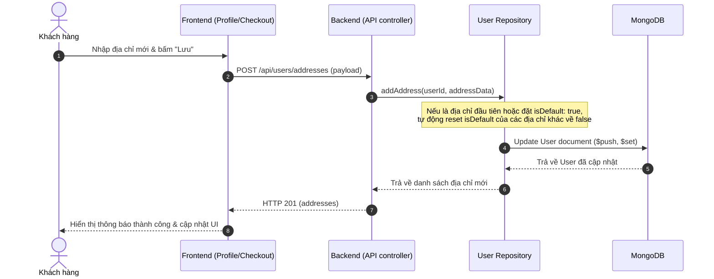

# Multiple Addresses - Architecture & Integration Documentation

Tài liệu này mô tả chi tiết kiến trúc, thiết kế cơ sở dữ liệu, các API Endpoints và cách thức tích hợp Frontend/Backend cho tính năng quản lý nhiều địa chỉ (Multiple Addresses) trong hệ thống **PubliCast**.

---

## 🏗️ 1. Thiết kế Cơ sở dữ liệu (Database Schema)

Để tối ưu hóa hiệu năng đọc (Read Performance) ở trang Profile và Checkout, chúng tôi sử dụng mô hình **Sub-document** trong Mongoose để lưu trữ mảng địa chỉ trực tiếp trong tài liệu `User`.

### Schema Định nghĩa ([User.js](file:///D:/Fullit/tutorials/PubliCast/backend/src/models/User.js)):
```javascript
const addressSchema = new mongoose.Schema({
  street: { type: String, required: true },
  province: { type: String, required: true },
  provinceCode: { type: String, required: true },
  ward: { type: String, required: true },
  wardCode: { type: String, required: true },
  fullText: { type: String, required: true },
  isDefault: { type: Boolean, default: false },
  coordinates: {
    lat: { type: Number, default: 10.8231 },
    lng: { type: Number, default: 106.6297 }
  }
});
```

---

## 🔄 2. Luồng hoạt động (Sequence Diagram)



---

## 🌐 3. Danh sách API Endpoints

Tất cả các API dưới đây đều được bảo vệ bởi middleware xác thực `verifyAuth`.

| Method | Endpoint | Description | Status Code |
|---|---|---|---|
| **GET** | `/api/users/addresses` | Lấy danh sách địa chỉ của người dùng hiện tại | `200 OK` |
| **POST** | `/api/users/addresses` | Thêm một địa chỉ mới | `201 Created` |
| **PUT** | `/api/users/addresses/:addressId` | Cập nhật thông tin địa chỉ theo ID | `200 OK` |
| **DELETE** | `/api/users/addresses/:addressId` | Xóa địa chỉ theo ID | `200 OK` |
| **PATCH** | `/api/users/addresses/:addressId/default` | Đặt địa chỉ cụ thể làm địa chỉ mặc định | `200 OK` |

---

## 🛡️ 4. Quản lý Lỗi Nghiệp vụ (No Magic Strings)

Các hằng số thông báo lỗi được định nghĩa tập trung tại [constants.js](file:///D:/Fullit/tutorials/PubliCast/backend/src/utils/constants.js):
```javascript
const ERROR_MESSAGES = {
  // ...
  ADDRESS_NOT_FOUND: 'Address not found',
  ADDRESS_REQUIRED: 'Address information is required',
  INVALID_ADDRESS_DATA: 'Invalid address data'
};
```

---

## 🧪 5. Kết quả Kiểm thử tự động (Automated Validation)

Hệ thống đã được bao phủ hoàn toàn bởi các bộ Test Suite:
1. **Unit Test cho Repository:** [user_address.test.js](file:///D:/Fullit/tutorials/PubliCast/backend/src/tests/user_address.test.js) (5/5 PASS)
2. **Integration Test cho API Endpoints:** [user_address_api.test.js](file:///D:/Fullit/tutorials/PubliCast/backend/src/tests/user_address_api.test.js) (5/5 PASS)
