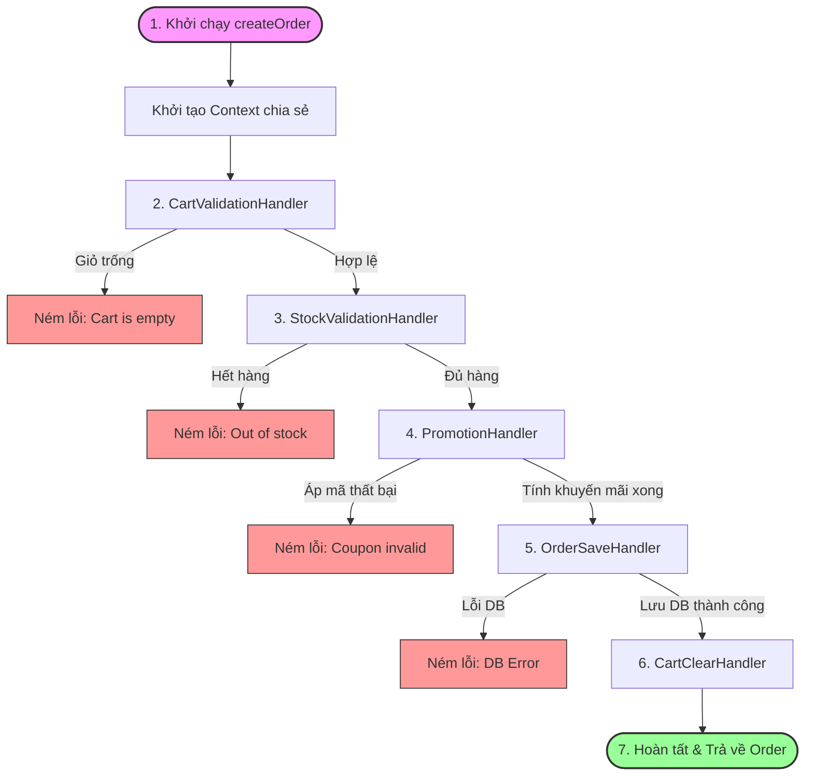

# Cơ chế Chain of Responsibility (CoR) trong Luồng Đặt hàng (Order Workflow)

Hệ thống đặt hàng của PubliCast được xây dựng trên mẫu thiết kế **Chain of Responsibility (Chuỗi trách nhiệm)** để phân tách các bước xử lý nghiệp vụ phức tạp thành các mắt xích (Handler) độc lập và tuần tự. Cấu trúc này giúp tuân thủ tuyệt đối các nguyên lý SOLID, đặc biệt là **Single Responsibility Principle (SRP)** và **Open/Closed Principle (OCP)**.

---

## 1. Bản đồ tổng quan luồng xử lý (Workflow Diagram)

Dưới đây là mô hình di chuyển của yêu cầu đặt hàng qua các mắt xích xử lý:



---

## 2. Các thành phần cốt lõi của cơ chế

### A. Đối tượng Context chia sẻ (Shared Context)
Đối tượng `context` đóng vai trò là "vùng nhớ chung" được truyền qua từng mắt xích để gom tụ và biến đổi dữ liệu tích lũy:
```javascript
const context = {
  userId,          // ID khách hàng đặt hàng
  orderInfo,       // Thông tin giao hàng (địa chỉ, SĐT, ghi chú, mã voucher...)
  cart: null,      // Dữ liệu giỏ hàng (sẽ được CartValidationHandler nạp vào)
  orderItems: [],  // Danh sách sản phẩm mua thực tế
  shippingFee: 0,  // Phí vận chuyển
  discountAmount: 0, // Số tiền được giảm giá (do PromotionHandler tính toán)
  giftItems: [],   // Quà tặng tặng kèm (do PromotionHandler thêm vào)
  finalAmount: 0,  // Số tiền cuối cùng cần thanh toán sau giảm giá
  order: null      // Đối tượng Order sau khi lưu DB (do OrderSaveHandler tạo ra)
};
```

### B. Base Handler (`OrderHandler.js`)
Lớp cha trừu tượng định nghĩa khả năng thiết lập liên kết động (`setNext`) và cơ chế chuyển giao trách nhiệm xử lý tiếp theo (`handle`):
- `setNext(handler)`: Trả về chính handler tiếp theo, cho phép sử dụng cú pháp nối chuỗi mượt mà (Fluent API) như: `handlerA.setNext(handlerB).setNext(handlerC)`.
- `handle(context)`: Kiểm tra sự tồn tại của handler tiếp theo (`this.nextHandler`). Nếu có, chuyển giao context sang; ngược lại, dừng chuỗi và trả về context kết quả.

---

## 3. Hoạt động chi tiết của từng Mắt xích (Concrete Handlers)

| Tên Handler | Nhiệm vụ nghiệp vụ | Hành động khi Thất bại | Hành động khi Thành công |
| :--- | :--- | :--- | :--- |
| **`CartValidationHandler`** | Truy vấn giỏ hàng của user từ CSDL. Đảm bảo giỏ hàng có tồn tại và không trống. | Ném lỗi `Cart is empty`, dừng toàn bộ chuỗi đặt hàng ngay lập tức. | Gán giỏ hàng vào `context.cart` và chuyển tiếp đến `StockValidationHandler`. |
| **`StockValidationHandler`** | Duyệt qua danh sách sản phẩm trong giỏ hàng và đối chiếu với số lượng tồn kho thực tế trong DB. | Ném lỗi nếu sản phẩm bất kỳ bị vượt quá tồn kho khả dụng. | Chuyển tiếp đến `PromotionHandler`. |
| **`PromotionHandler`** | Lấy mã khuyến mãi khách hàng gửi lên (nếu có), sử dụng `PromotionCalculatorFacade` để áp dụng lịch trình, điều kiện và tính toán số tiền giảm giá hoặc nạp quà tặng đính kèm. | Ném lỗi nếu mã khuyến mãi không khả dụng hoặc hết hạn. | Gán `discountAmount`, `giftItems` và `finalAmount` vào context. Chuyển sang `OrderSaveHandler`. |
| **`OrderSaveHandler`** | Tạo một bản ghi Order mới với các thông tin đã tính toán xong, tiến hành trừ kho sản phẩm và kho quà tặng, cập nhật số lượt dùng mã khuyến mãi, lưu bản ghi vào CSDL. | Ném lỗi hệ thống nếu lưu DB thất bại. | Gán đơn hàng đã tạo vào `context.order` và chuyển sang `CartClearHandler`. |
| **`CartClearHandler`** | Dọn dẹp sạch giỏ hàng của khách hàng sau khi đơn hàng đã chắc chắn được thanh toán/lưu trữ thành công. | Ném lỗi nếu việc xóa giỏ hàng lỗi. | Kết thúc chuỗi và trả về đơn hàng cho client. |

---

## 4. Cách thức mở rộng chuỗi không ảnh hưởng đến Logic cũ (Nguyên lý OCP)

Nhờ áp dụng CoR, khi có yêu cầu thêm một bước nghiệp vụ mới (ví dụ: **Kiểm tra phát hiện gian lận (Fraud Detection)** trước khi xác định kho sản phẩm), quy trình thực hiện chỉ bao gồm 2 bước đơn giản mà không cần sửa đổi bất kỳ dòng code nghiệp vụ cũ nào:

1. **Tạo Handler mới** `FraudCheckHandler.js` kế thừa từ `OrderHandler`:
   ```javascript
   const OrderHandler = require('./OrderHandler');

   class FraudCheckHandler extends OrderHandler {
     async handle(context) {
       const isSuspicious = await checkFraud(context.userId);
       if (isSuspicious) {
         throw new Error('Tài khoản bị nghi ngờ gian lận. Giao dịch bị chặn!');
       }
       return await super.handle(context); // Đi tiếp
     }
   }
   module.exports = FraudCheckHandler;
   ```
2. **Khai báo chèn vào chuỗi** tại `OrderChainFactory`:
   ```javascript
   const fraudCheck = new FraudCheckHandler();
   
   // Chèn fraudCheck vào trước bước kiểm tra kho
   cartValidation
     .setNext(fraudCheck)
     .setNext(stockValidation)
     .setNext(promotion)
     .setNext(orderSave)
     .setNext(cartClear);
   ```
