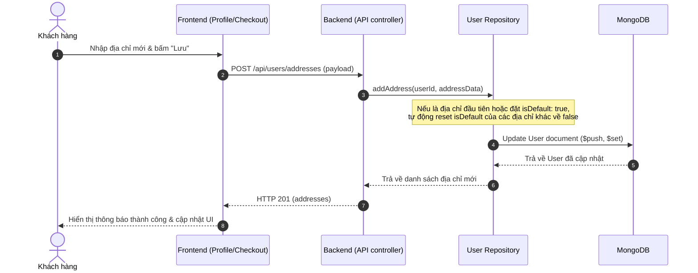

# Multiple Addresses Implementation Plan

> **For Claude:** REQUIRED SUB-SKILL: Use superpowers:executing-plans to implement this plan task-by-task.

**Goal:** Cho phép mỗi người dùng lưu và quản lý nhiều địa chỉ (Multiple Addresses) trong Profile, đặt một địa chỉ làm mặc định, và chọn nhanh địa chỉ khi thanh toán.

**Architecture:** 
* **Database:** Sử dụng mô hình **Sub-document** trong Mongoose (lưu mảng địa chỉ trực tiếp trong tài liệu `User`). 
  * *Lý do tối ưu:* Trong ứng dụng E-commerce, số lượng địa chỉ của một người dùng thường ít (dưới 10 địa chỉ). Việc lưu trữ trực tiếp dưới dạng mảng sub-documents giúp việc lấy thông tin User kèm danh sách địa chỉ chỉ tốn **1 câu truy vấn (No Join/Lookup)**, tối ưu hiệu năng đọc cực lớn tại trang Profile và Checkout.
* **Backend APIs:** Xây dựng bộ API quản lý địa chỉ độc lập trên tuyến đường `/api/users/addresses` (GET, POST, PUT, DELETE, PATCH).
* **Frontend UI:** 
  * **Profile:** Thêm tab/khu vực quản lý danh sách địa chỉ, cho phép Thêm mới/Chỉnh sửa (tích hợp Leaflet Map Pin), Xóa, và Đặt làm mặc định.
  * **Checkout:** Hiển thị danh sách địa chỉ dưới dạng Radio Buttons để chọn nhanh, tự động chọn địa chỉ mặc định, hoặc cho phép nhập địa chỉ mới.

**Tech Stack:** Node.js (Express), Mongoose, React, Tailwind CSS, Leaflet Map

---

## 📊 Cấu Trúc Dữ Liệu (Mongoose Schema)

Trường `addresses` được định nghĩa trong `User.js` như sau:
```javascript
const addressSchema = new mongoose.Schema({
  street: { type: String, required: true },
  province: { type: String, required: true },
  provinceCode: { type: String, required: true },
  ward: { type: String, required: true },
  wardCode: { type: String, required: true },
  fullText: { type: String, required: true },
  isDefault: { type: Boolean, default: false },
  coordinates: {
    lat: { type: Number, default: 10.8231 },
    lng: { type: Number, default: 106.6297 }
  }
});
```

---

## 🔄 Luồng Hoạt Động (Sequence Diagram)

### Luồng 1: Thêm Địa chỉ Mới & Đặt Mặc định


---

## 📝 Các Task Chi Tiết

### Task 1: Cập nhật Schema User và Repository - [x] Completed

**Files:**
* Modify: [backend/src/models/User.js](file:///D:/Fullit/tutorials/PubliCast/backend/src/models/User.js)
* Create: [backend/src/repositories/user.repository.js](file:///D:/Fullit/tutorials/PubliCast/backend/src/repositories/user.repository.js)
* Create: [backend/src/tests/user_address.test.js](file:///D:/Fullit/tutorials/PubliCast/backend/src/tests/user_address.test.js)

**Step 1: Viết test kiểm thử Repository**
Tạo file [user_address.test.js](file:///D:/Fullit/tutorials/PubliCast/backend/src/tests/user_address.test.js) để kiểm tra các hàm thêm, sửa, xóa, và đặt mặc định địa chỉ hoạt động đúng đắn.

**Step 2: Cập nhật User Schema**
Chuyển đổi trường `address` thành:
```javascript
  addresses: [addressSchema],
```
*(Giữ lại trường `address` Mixed cũ để tương thích ngược nếu cần, nhưng chuyển sang khuyến khích dùng `addresses`)*.

**Step 3: Cài đặt User Repository**
Viết các hàm:
* `addAddress(userId, addressData)`: Thêm địa chỉ mới. Nếu `addressData.isDefault` là `true`, cập nhật tất cả các địa chỉ khác của user thành `isDefault: false`.
* `updateAddress(userId, addressId, addressData)`: Cập nhật địa chỉ theo ID. Nếu `addressData.isDefault` là `true`, cập nhật tất cả các địa chỉ khác của user thành `isDefault: false`.
* `deleteAddress(userId, addressId)`: Xóa địa chỉ. Nếu địa chỉ bị xóa đang là mặc định, tự động gán địa chỉ còn lại đầu tiên (nếu có) làm mặc định.
* `setDefaultAddress(userId, addressId)`: Cập nhật địa chỉ cụ thể làm mặc định và đặt các địa chỉ khác thành `false`.

**Step 4: Chạy test repository**
Chạy: `npm test backend/src/tests/user_address.test.js`
Yêu cầu: PASS.

**Step 5: Commit**
`git add backend/src/models/User.js backend/src/repositories/user.repository.js backend/src/tests/user_address.test.js`
`git commit -m "feat: add user addresses sub-document schema and repository helper functions"`

---

### Task 2: Cài đặt API Endpoints (Controller, Route) - [x] Completed

**Files:**
* Create: [backend/src/controllers/userAddress.controller.js](file:///D:/Fullit/tutorials/PubliCast/backend/src/controllers/userAddress.controller.js)
* Modify: [backend/src/routes/user.routes.js](file:///D:/Fullit/tutorials/PubliCast/backend/src/routes/user.routes.js)
* Create: [backend/src/tests/user_address_api.test.js](file:///D:/Fullit/tutorials/PubliCast/backend/src/tests/user_address_api.test.js)

**Step 1: Viết Integration Test cho API**
Viết các test case kiểm tra mã HTTP trả về đúng cho các API:
* `GET /api/users/addresses` -> 200 OK
* `POST /api/users/addresses` -> 201 Created
* `PUT /api/users/addresses/:addressId` -> 200 OK
* `DELETE /api/users/addresses/:addressId` -> 200 OK
* `PATCH /api/users/addresses/:addressId/default` -> 200 OK

**Step 2: Viết Controller**
Cài đặt các controller ứng với các route trên, gọi đến repository tương ứng và validate dữ liệu (street, province, provinceCode, ward, wardCode phải có đầy đủ).

**Step 3: Đăng ký Route**
Khai báo các route trong `user.routes.js` sử dụng middleware xác thực `auth.middleware.js`.

**Step 4: Chạy test API**
Chạy: `npm test backend/src/tests/user_address_api.test.js`
Yêu cầu: PASS.

**Step 5: Commit**
`git add backend/src/controllers/userAddress.controller.js backend/src/routes/user.routes.js backend/src/tests/user_address_api.test.js`
`git commit -m "feat: implement HTTP endpoints for multiple address management with auth protection"`

---

### Task 3: Tích hợp Giao diện Quản lý Địa chỉ trong Profile - [x] Completed

**Files:**
* Modify: [frontend/src/services/user.service.js](file:///D:/Fullit/tutorials/PubliCast/frontend/src/services/user.service.js)
* Modify: [frontend/src/pages/Profile.jsx](file:///D:/Fullit/tutorials/PubliCast/frontend/src/pages/Profile.jsx)

**Step 1: Thêm API client**
Trong `user.service.js`, thêm các hàm:
* `getAddresses()`
* `addAddress(address)`
* `updateAddress(addressId, address)`
* `deleteAddress(addressId)`
* `setDefaultAddress(addressId)`

**Step 2: Thiết kế lại tab "Thông tin cá nhân" trong Profile**
* Tách khu vực Quản lý địa chỉ thành một phần riêng (Address Manager).
* Hiển thị danh sách địa chỉ dạng Cards. Mỗi địa chỉ hiển thị text đầy đủ, nhãn "Mặc định" nếu `isDefault: true`, nút "Đặt mặc định", "Sửa" và "Xóa".
* Sử dụng lại Modal Map Pin hiện có để cho phép ghim vị trí khi thêm mới/sửa địa chỉ.

**Step 3: Commit**
`git add frontend/src/services/user.service.js frontend/src/pages/Profile.jsx`
`git commit -m "feat: design address manager UI in Profile page with CRUD and Set Default actions"`

---

### Task 4: Tích hợp Chọn Địa chỉ khi Thanh toán (Checkout) - [x] Completed

**Files:**
* Modify: [frontend/src/pages/Checkout.jsx](file:///D:/Fullit/tutorials/PubliCast/frontend/src/pages/Checkout.jsx)

**Step 1: Nạp danh sách địa chỉ khi load Checkout**
* Lấy danh sách địa chỉ của người dùng.
* Nếu người dùng đã có địa chỉ mặc định, tự động gán địa chỉ đó làm địa chỉ nhận hàng ban đầu.

**Step 2: Hiển thị danh sách địa chỉ đã lưu**
* Hiển thị các địa chỉ dưới dạng Radio Buttons để người dùng chọn nhanh.
* Thêm một tùy chọn radio: "Nhập địa chỉ mới". Khi chọn tùy chọn này, hiển thị Form nhập địa chỉ (Tỉnh thành -> Phường xã -> Số nhà/Đường + Bản đồ) giống như trước đây.

**Step 3: Gửi payload đặt hàng**
* Nếu chọn địa chỉ đã lưu, gửi thông tin địa chỉ đó làm `shippingAddress`.
* Nếu chọn nhập địa chỉ mới, validate và gửi địa chỉ mới nhập.

**Step 4: Commit**
`git add frontend/src/pages/Checkout.jsx`
`git commit -m "feat: integrate multiple address selection using radio list during checkout"`
